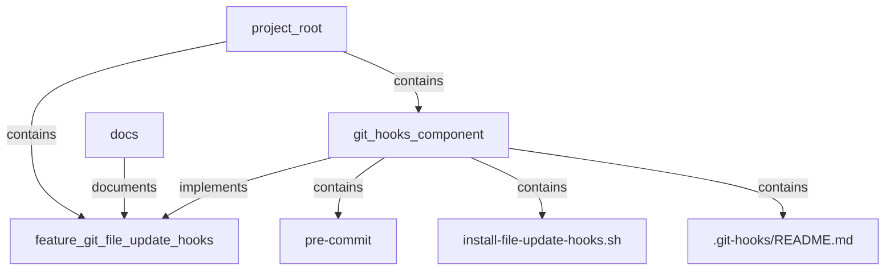
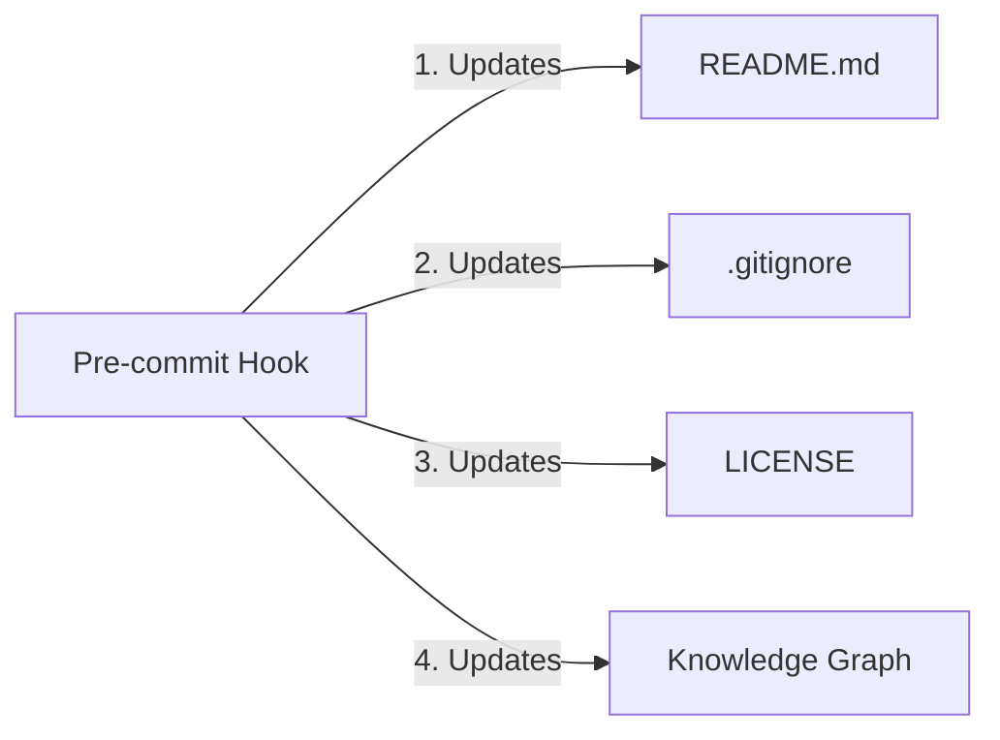

# Git Pre-commit Hook Automation Documentation Plan

## Overview

This document outlines the plan for documenting the Git pre-commit hook automation in the MCP-BASE-STACK knowledge graph. The automation updates README.md, .gitignore, and LICENSE files before every commit without requiring explicit user action.

## Current Understanding

1. The Git pre-commit hook automation:
   - Updates README.md with a timestamp
   - Updates .gitignore with common files to ignore
   - Updates LICENSE copyright year
   - All updates are done automatically before every commit

2. The knowledge graph structure:
   - Supports various node types: Component, Feature, Directory, File
   - Supports relationships: DEPENDS_ON, IMPLEMENTS, CONNECTS_TO, CONTAINS, DOCUMENTS, TESTS
   - Can be updated using Python scripts

3. Additional requirement:
   - The knowledge graph should also be updated before every commit

## Implementation Plan

### 1. Document the Git Hooks as a Feature and Component



### 2. Add Knowledge Graph Update to Pre-commit Hook



### 3. Detailed Steps

1. **Register the Git File Update Hooks as a Feature**:
   - Use `register_feature.py` to add a new feature called "Git File Update Hooks"
   - Set description, owner, and status

2. **Add Git Hooks as a Component**:
   - Add a new component node "git_hooks" to the knowledge graph
   - Set appropriate attributes (type, status, etc.)

3. **Add File Nodes for Hook Files**:
   - Add nodes for `.git-hooks/pre-commit`, `install-file-update-hooks.sh`, and `.git-hooks/README.md`
   - Set appropriate attributes (path, type, etc.)

4. **Create Relationships**:
   - Connect the component to the feature (IMPLEMENTS)
   - Connect the component to the files (CONTAINS)
   - Connect the project root to the component (CONTAINS)
   - Add any other relevant relationships

5. **Modify Pre-commit Hook to Update Knowledge Graph**:
   - Add a new section to the pre-commit hook script that runs `update_knowledge_graph.py`
   - Ensure it only runs if the script exists and is executable
   - Add appropriate error handling

6. **Update Documentation**:
   - Update `.git-hooks/README.md` to mention knowledge graph updates
   - Ensure installation instructions are clear

### 4. Code Changes

#### A. Register the Feature

```python
# Using register_feature.py
python3 core/kg/scripts/register_feature.py \
  --name "Git File Update Hooks" \
  --description "Automatically updates README.md, .gitignore, LICENSE, and Knowledge Graph before every commit" \
  --owner "DevOps Team"
```

#### B. Add Component and Relationships

```python
# Add to update_knowledge_graph.py or create a new script
def add_git_hooks_to_kg():
    # Load existing graphs
    nx_graph = nx.read_graphml(f"{KG_DATA_DIR}/knowledge_graph.graphml")
    rdf_graph = Graph()
    rdf_graph.parse(f"{KG_DATA_DIR}/knowledge_graph.ttl", format="turtle")
    
    # Namespace for RDF
    ns = Namespace(f"http://{PROJECT_NAME.lower()}.org/")
    
    # Add git_hooks component
    component_id = "git_hooks"
    nx_graph.add_node(
        component_id, 
        type="component", 
        name="Git Hooks",
        status="implemented"
    )
    
    # Connect to project_root
    nx_graph.add_edge("project_root", component_id, relation="contains")
    
    # Add file nodes
    files = [
        (".git-hooks/pre-commit", "pre_commit_hook"),
        ("install-file-update-hooks.sh", "install_hooks_script"),
        (".git-hooks/README.md", "hooks_documentation")
    ]
    
    for file_path, file_id in files:
        nx_graph.add_node(
            file_id,
            type="file",
            path=file_path,
            language="bash" if file_path.endswith(".sh") else "markdown"
        )
        nx_graph.add_edge(component_id, file_id, relation="contains")
    
    # Connect to feature
    feature_id = "feature_git_file_update_hooks"
    if feature_id in nx_graph:
        nx_graph.add_edge(component_id, feature_id, relation="implements")
    
    # Save updated graphs
    nx.write_graphml(nx_graph, f"{KG_DATA_DIR}/knowledge_graph.graphml")
    rdf_graph.serialize(destination=f"{KG_DATA_DIR}/knowledge_graph.ttl", format="turtle")
```

#### C. Modify Pre-commit Hook

```bash
# Add to .git-hooks/pre-commit

# ============================================================================
# 4. Update Knowledge Graph
# ============================================================================
if [ -f "core/kg/scripts/update_knowledge_graph.py" ]; then
    echo "Updating Knowledge Graph..."
    
    # Run the update script
    if python3 core/kg/scripts/update_knowledge_graph.py; then
        echo "Knowledge Graph updated successfully"
    else
        echo "Warning: Knowledge Graph update failed"
    fi
else
    echo "Knowledge Graph update script not found, skipping"
fi
```

### 5. Testing

1. Test the feature registration
2. Test the component and relationship additions
3. Test the pre-commit hook with knowledge graph updates
4. Verify the knowledge graph contains the correct information

## Implementation Notes

- The implementation should be done in a way that doesn't break existing functionality
- Error handling should be robust to prevent commit failures due to knowledge graph issues
- Documentation should be updated to reflect the new functionality