# MCP-BASE-STACK Specification Manifest Plan

## Overview

The specification manifest will serve as the single source of truth for the Autonomous AI Coding Agent, codifying standards for directory structure, file organization, naming conventions, and required code patterns. This manifest will be created in JSON format for optimal machine readability and programmatic access, with strict validation rules and schema enforcement.

## Information Sources

The manifest will be based on the following key documents:
- Style Guide (naming conventions, documentation standards, code formatting)
- Coding Conventions (function/class design, error handling, security practices)
- Graph Guidelines (knowledge graph structure, node/relationship types)
- Review Checklist (quality standards, testing requirements)
- Knowledge Graph Schema (formal definition of node/edge types)

## Manifest Structure

```json
{
  "specification_manifest": {
    "metadata": {
      "version": "1.0.0",
      "created_at": "2025-04-07",
      "description": "Specification manifest for MCP-BASE-STACK"
    },
    "directory_structure": {},
    "file_templates": {},
    "naming_conventions": {},
    "code_patterns": {},
    "validation_rules": {}
  }
}
```

## Implementation Steps

### 1. Define Directory Structure Standards

Extract from style-guide.md and current project structure:

```json
{
  "directory_structure": {
    "root": {
      "description": "Project root directory",
      "required_subdirectories": [
        "docs",
        "config",
        "core",
        "services",
        "scripts",
        "tests"
      ],
      "optional_subdirectories": [
        "data",
        "deploy",
        "LibreChat"
      ]
    },
    "docs": {
      "description": "Project documentation",
      "required_subdirectories": [
        "conventions",
        "knowledge-graph",
        "tutorials",
        "troubleshooting"
      ]
    }
  }
}
```

### 2. Define Expected Files per Folder

For each directory, document required and optional files:

```json
{
  "file_templates": {
    "root": {
      "required_files": {
        "README.md": {
          "description": "Project overview",
          "template": "# MCP-BASE-STACK\n\n## Overview\n\n[Project description]\n\n## Installation\n\n[Installation instructions]"
        },
        "LICENSE": {
          "description": "Project license"
        },
        ".gitignore": {
          "description": "Git ignore file"
        }
      },
      "optional_files": {
        "pyproject.toml": {
          "description": "Python project configuration"
        }
      }
    }
  }
}
```

### 3. Codify Naming Conventions

Extract naming conventions from style-guide.md and coding-conventions.md:

```json
{
  "naming_conventions": {
    "python": {
      "packages": {
        "pattern": "snake_case",
        "regex": "^[a-z][a-z0-9_]*$",
        "examples": [
          "knowledge_graph",
          "core"
        ]
      },
      "modules": {
        "pattern": "snake_case.py",
        "regex": "^[a-z][a-z0-9_]*\\.py$",
        "examples": [
          "config.py",
          "error.py"
        ]
      },
      "classes": {
        "pattern": "CamelCase",
        "regex": "^[A-Z][a-zA-Z0-9]*$",
        "examples": [
          "ConfigManager",
          "KnowledgeGraph"
        ]
      }
    },
    "shell": {
      "scripts": {
        "pattern": "kebab-case.sh",
        "regex": "^[a-z][a-z0-9-]*\\.sh$",
        "examples": [
          "create-backup.sh",
          "install-hooks.sh"
        ]
      }
    }
  }
}
```

### 4. Define Required Code Patterns

Document required code patterns for different file types:

```json
{
  "code_patterns": {
    "python": {
      "module_header": {
        "description": "Standard module header with docstring",
        "required": true,
        "template": "\"\"\"\\n[Module description]\\n\\nThis module provides [functionality description].\\n\"\"\"\\n\\n# Standard library imports\\n\\n# Third-party imports\\n\\n# Local imports",
        "validation_regex": "^\\s*\"\"\"[\\s\\S]*?\"\"\"\\s*$"
      },
      "class_definition": {
        "description": "Standard class definition with docstring",
        "required": true,
        "template": "class ClassName:\\n    \"\"\"[Class description]\\n    \\n    This class provides [functionality description].\\n    \\n    Attributes:\\n        attribute_name: Description of the attribute.\\n    \"\"\"",
        "validation_regex": "^\\s*class\\s+[A-Z][a-zA-Z0-9]*\\s*(?:\\([^)]*\\))?\\s*:\\s*\\n\\s+\"\"\"[\\s\\S]*?\"\"\"\\s*$"
      }
    },
    "shell": {
      "script_header": {
        "description": "Standard shell script header",
        "required": true,
        "template": "#!/bin/bash\\n#\\n# Description: [Script description]\\n\\n# Exit on error\\nset -e",
        "validation_regex": "^#!/bin/bash\\s*\\n#\\s*\\n#\\s*Description:\\s*.*\\n\\n#\\s*Exit on error\\s*\\nset -e"
      }
    }
  }
}
```

### 5. Define Validation Rules

Create rules to validate code against the manifest:

```json
{
  "validation_rules": {
    "directory_structure": [
      {
        "rule": "All required directories must exist",
        "severity": "error",
        "validation_function": "validateRequiredDirectories",
        "error_message": "Required directory '{directory}' is missing"
      },
      {
        "rule": "Directory names must follow naming conventions",
        "severity": "error",
        "validation_function": "validateDirectoryNames",
        "error_message": "Directory name '{directory}' does not follow the required pattern '{pattern}'"
      }
    ],
    "file_presence": [
      {
        "rule": "All required files must exist in their respective directories",
        "severity": "error",
        "validation_function": "validateRequiredFiles",
        "error_message": "Required file '{file}' is missing in directory '{directory}'"
      },
      {
        "rule": "File names must follow naming conventions",
        "severity": "error",
        "validation_function": "validateFileNames",
        "error_message": "File name '{file}' does not follow the required pattern '{pattern}'"
      }
    ],
    "code_patterns": [
      {
        "rule": "Python modules must have proper docstrings",
        "severity": "error",
        "validation_function": "validatePythonDocstrings",
        "error_message": "Python module '{file}' is missing proper docstring"
      },
      {
        "rule": "Shell scripts must have proper headers",
        "severity": "error",
        "validation_function": "validateShellHeaders",
        "error_message": "Shell script '{file}' is missing proper header"
      }
    ]
  }
}
```

## JSON Schema Definition

To ensure strict validation of the manifest itself, we will create a JSON Schema definition:

```json
{
  "$schema": "http://json-schema.org/draft-07/schema#",
  "title": "MCP-BASE-STACK Specification Manifest",
  "type": "object",
  "required": ["specification_manifest"],
  "properties": {
    "specification_manifest": {
      "type": "object",
      "required": ["metadata", "directory_structure", "file_templates", "naming_conventions", "code_patterns", "validation_rules"],
      "properties": {
        "metadata": {
          "type": "object",
          "required": ["version", "created_at", "description"],
          "properties": {
            "version": { "type": "string", "pattern": "^\\d+\\.\\d+\\.\\d+$" },
            "created_at": { "type": "string", "format": "date" },
            "description": { "type": "string" }
          },
          "additionalProperties": false
        },
        "directory_structure": {
          "type": "object",
          "patternProperties": {
            "^[a-z][a-z0-9_]*$": {
              "type": "object",
              "required": ["description"],
              "properties": {
                "description": { "type": "string" },
                "required_subdirectories": {
                  "type": "array",
                  "items": { "type": "string" }
                },
                "optional_subdirectories": {
                  "type": "array",
                  "items": { "type": "string" }
                }
              },
              "additionalProperties": false
            }
          },
          "additionalProperties": false
        },
        "file_templates": {
          "type": "object",
          "patternProperties": {
            "^[a-z][a-z0-9_]*$": {
              "type": "object",
              "properties": {
                "required_files": {
                  "type": "object",
                  "patternProperties": {
                    "^.*$": {
                      "type": "object",
                      "required": ["description"],
                      "properties": {
                        "description": { "type": "string" },
                        "template": { "type": "string" }
                      },
                      "additionalProperties": false
                    }
                  }
                },
                "optional_files": {
                  "type": "object",
                  "patternProperties": {
                    "^.*$": {
                      "type": "object",
                      "required": ["description"],
                      "properties": {
                        "description": { "type": "string" },
                        "template": { "type": "string" }
                      },
                      "additionalProperties": false
                    }
                  }
                }
              },
              "additionalProperties": false
            }
          },
          "additionalProperties": false
        },
        "naming_conventions": {
          "type": "object",
          "patternProperties": {
            "^[a-z][a-z0-9_]*$": {
              "type": "object",
              "patternProperties": {
                "^[a-z][a-z0-9_]*$": {
                  "type": "object",
                  "required": ["pattern", "regex"],
                  "properties": {
                    "pattern": { "type": "string" },
                    "regex": { "type": "string" },
                    "examples": {
                      "type": "array",
                      "items": { "type": "string" }
                    }
                  },
                  "additionalProperties": false
                }
              },
              "additionalProperties": false
            }
          },
          "additionalProperties": false
        },
        "code_patterns": {
          "type": "object",
          "patternProperties": {
            "^[a-z][a-z0-9_]*$": {
              "type": "object",
              "patternProperties": {
                "^[a-z][a-z0-9_]*$": {
                  "type": "object",
                  "required": ["description", "required", "template", "validation_regex"],
                  "properties": {
                    "description": { "type": "string" },
                    "required": { "type": "boolean" },
                    "template": { "type": "string" },
                    "validation_regex": { "type": "string" }
                  },
                  "additionalProperties": false
                }
              },
              "additionalProperties": false
            }
          },
          "additionalProperties": false
        },
        "validation_rules": {
          "type": "object",
          "patternProperties": {
            "^[a-z][a-z0-9_]*$": {
              "type": "array",
              "items": {
                "type": "object",
                "required": ["rule", "severity", "validation_function", "error_message"],
                "properties": {
                  "rule": { "type": "string" },
                  "severity": { "type": "string", "enum": ["error", "warning", "info"] },
                  "validation_function": { "type": "string" },
                  "error_message": { "type": "string" }
                },
                "additionalProperties": false
              }
            }
          },
          "additionalProperties": false
        }
      },
      "additionalProperties": false
    }
  },
  "additionalProperties": false
}
```

## Autonomous AI Coding Agent Integration

The specification manifest is designed to be the primary reference for the Autonomous AI Coding Agent, guiding its behavior and decision-making processes. This section details how the agent will utilize the manifest.

### 1. Code Generation Capabilities

The Autonomous AI Coding Agent will use the manifest to generate code that adheres to project standards:

```json
{
  "agent_integration": {
    "code_generation": {
      "directory_creation": {
        "description": "Generate directory structures that comply with project standards",
        "process": [
          "Agent consults manifest's directory_structure section",
          "Creates required directories in the correct hierarchy",
          "Ensures directory names follow naming conventions"
        ],
        "example": "When creating a new feature, agent automatically creates all required subdirectories"
      },
      "file_creation": {
        "description": "Generate files with proper templates and naming",
        "process": [
          "Agent consults manifest's file_templates section",
          "Creates files using the specified templates",
          "Ensures file names follow naming conventions"
        ],
        "example": "When creating a new Python module, agent automatically includes proper docstrings and import organization"
      },
      "code_structure": {
        "description": "Generate code that follows required patterns",
        "process": [
          "Agent consults manifest's code_patterns section",
          "Structures code according to the specified patterns",
          "Includes required elements like docstrings, error handling, etc."
        ],
        "example": "When generating a new class, agent automatically includes proper docstrings, type hints, and error handling"
      }
    }
  }
}
```

### 2. Code Analysis and Validation

The agent will analyze existing code against the manifest's standards:

```json
{
  "agent_integration": {
    "code_analysis": {
      "structure_validation": {
        "description": "Validate project structure against manifest standards",
        "process": [
          "Agent scans project directory structure",
          "Compares against manifest's directory_structure section",
          "Identifies missing or incorrectly named directories"
        ],
        "example": "Agent detects and reports missing required directories"
      },
      "naming_validation": {
        "description": "Validate naming conventions in code",
        "process": [
          "Agent analyzes file and symbol names",
          "Compares against manifest's naming_conventions section",
          "Identifies violations of naming conventions"
        ],
        "example": "Agent detects and reports incorrectly named variables or classes"
      },
      "pattern_validation": {
        "description": "Validate code patterns in files",
        "process": [
          "Agent analyzes code structure",
          "Compares against manifest's code_patterns section",
          "Identifies violations of required patterns"
        ],
        "example": "Agent detects and reports missing docstrings or improper error handling"
      }
    }
  }
}
```

### 3. Code Refactoring and Improvement

The agent will use the manifest to guide code refactoring:

```json
{
  "agent_integration": {
    "code_refactoring": {
      "structure_refactoring": {
        "description": "Refactor project structure to comply with standards",
        "process": [
          "Agent identifies structural issues",
          "Proposes directory reorganization based on manifest",
          "Implements approved changes while maintaining functionality"
        ],
        "example": "Agent reorganizes files into the correct directory structure"
      },
      "naming_refactoring": {
        "description": "Refactor names to comply with conventions",
        "process": [
          "Agent identifies naming convention violations",
          "Proposes name changes based on manifest",
          "Implements approved changes with proper reference updates"
        ],
        "example": "Agent renames variables and updates all references to maintain functionality"
      },
      "pattern_refactoring": {
        "description": "Refactor code to comply with required patterns",
        "process": [
          "Agent identifies pattern violations",
          "Proposes code changes based on manifest",
          "Implements approved changes while maintaining functionality"
        ],
        "example": "Agent adds missing docstrings or improves error handling"
      }
    }
  }
}
```

### 4. Decision-Making Process

The agent will use the manifest to inform its decision-making:

```json
{
  "agent_integration": {
    "decision_making": {
      "file_placement": {
        "description": "Decide where new files should be placed",
        "process": [
          "Agent analyzes file purpose and type",
          "Consults manifest's directory_structure section",
          "Determines optimal location based on project standards"
        ],
        "example": "When creating a new utility function, agent places it in the appropriate module"
      },
      "naming_selection": {
        "description": "Select appropriate names for new elements",
        "process": [
          "Agent analyzes element purpose and type",
          "Consults manifest's naming_conventions section",
          "Generates names that follow conventions"
        ],
        "example": "When creating a new class, agent generates a name that follows CamelCase convention"
      },
      "pattern_application": {
        "description": "Apply appropriate patterns to new code",
        "process": [
          "Agent analyzes code purpose and context",
          "Consults manifest's code_patterns section",
          "Applies appropriate patterns based on context"
        ],
        "example": "When creating a function that accesses resources, agent automatically implements proper resource management"
      }
    }
  }
}
```

### 5. Contextual Understanding

The agent will use the manifest to understand project context:

```json
{
  "agent_integration": {
    "contextual_understanding": {
      "project_structure": {
        "description": "Understand the overall project structure",
        "process": [
          "Agent loads manifest's directory_structure section",
          "Builds mental model of project organization",
          "Uses this understanding to navigate and reason about the codebase"
        ],
        "example": "Agent understands that tests should be in the tests directory, organized by test type"
      },
      "code_organization": {
        "description": "Understand how code should be organized",
        "process": [
          "Agent loads manifest's code_patterns section",
          "Builds mental model of code organization patterns",
          "Uses this understanding to structure new code"
        ],
        "example": "Agent understands that imports should be organized in a specific order"
      },
      "naming_semantics": {
        "description": "Understand the semantics conveyed by naming conventions",
        "process": [
          "Agent loads manifest's naming_conventions section",
          "Builds mental model of naming semantics",
          "Uses this understanding to interpret existing code and name new elements"
        ],
        "example": "Agent understands that a leading underscore indicates a private attribute"
      }
    }
  }
}
```

### 6. Interactive Guidance

The agent will use the manifest to provide guidance to developers:

```json
{
  "agent_integration": {
    "interactive_guidance": {
      "error_explanation": {
        "description": "Explain validation errors to developers",
        "process": [
          "Agent detects validation errors",
          "Consults manifest for relevant rules and patterns",
          "Provides clear explanation with reference to standards"
        ],
        "example": "Agent explains that a class name violates naming conventions and suggests a compliant alternative"
      },
      "suggestion_provision": {
        "description": "Provide suggestions for improvement",
        "process": [
          "Agent analyzes code against manifest standards",
          "Identifies opportunities for improvement",
          "Suggests changes with reference to standards"
        ],
        "example": "Agent suggests adding type hints to a function to comply with coding conventions"
      },
      "standard_education": {
        "description": "Educate developers about project standards",
        "process": [
          "Agent identifies knowledge gaps based on code patterns",
          "Consults manifest for relevant standards",
          "Provides educational information about standards"
        ],
        "example": "Agent explains the project's error handling pattern when a developer uses a different approach"
      }
    }
  }
}
```

### 7. Continuous Improvement

The agent will contribute to the evolution of the manifest:

```json
{
  "agent_integration": {
    "continuous_improvement": {
      "pattern_identification": {
        "description": "Identify emerging patterns in the codebase",
        "process": [
          "Agent analyzes code across the project",
          "Identifies recurring patterns not in the manifest",
          "Suggests additions to the manifest"
        ],
        "example": "Agent identifies a common logging pattern and suggests adding it to the manifest"
      },
      "standard_refinement": {
        "description": "Suggest refinements to existing standards",
        "process": [
          "Agent analyzes application of standards",
          "Identifies areas where standards could be improved",
          "Suggests refinements to the manifest"
        ],
        "example": "Agent suggests improving a regex pattern to handle edge cases"
      },
      "validation_enhancement": {
        "description": "Suggest enhancements to validation rules",
        "process": [
          "Agent analyzes validation results",
          "Identifies false positives or negatives",
          "Suggests improvements to validation rules"
        ],
        "example": "Agent suggests adding a new validation rule to catch a common error pattern"
      }
    }
  }
}
```

## Validation and Enforcement Mechanisms

To ensure strict validation and enforcement of the manifest, we will implement:

### 1. Schema Validation

- Use JSON Schema to validate the manifest structure
- Implement schema validation in CI/CD pipelines
- Provide a command-line tool for local validation

```json
{
  "validation_mechanisms": {
    "schema_validation": {
      "description": "Validate the manifest against its JSON Schema",
      "implementation": "Use ajv or similar JSON Schema validator",
      "integration_points": [
        "Pre-commit hook",
        "CI/CD pipeline",
        "Command-line tool"
      ]
    }
  }
}
```

### 2. Content Validation

- Validate that all referenced patterns, regexes, and functions exist
- Ensure all examples match their corresponding patterns
- Verify that all templates are valid and well-formed

```json
{
  "validation_mechanisms": {
    "content_validation": {
      "description": "Validate the content of the manifest",
      "checks": [
        "All regex patterns are valid and compile",
        "All examples match their corresponding patterns",
        "All templates are well-formed",
        "All validation functions exist in the codebase"
      ]
    }
  }
}
```

### 3. Consistency Validation

- Check for internal consistency within the manifest
- Ensure no contradictory rules or patterns
- Verify that all references are valid

```json
{
  "validation_mechanisms": {
    "consistency_validation": {
      "description": "Validate the internal consistency of the manifest",
      "checks": [
        "No contradictory rules or patterns",
        "All internal references are valid",
        "No circular dependencies",
        "No duplicate definitions"
      ]
    }
  }
}
```

### 4. Enforcement Tools

- Create linters and validators that use the manifest
- Integrate with IDE extensions
- Implement automated code generation tools

```json
{
  "enforcement_tools": {
    "linters": {
      "description": "Linters that enforce the manifest rules",
      "implementations": [
        "Custom flake8 plugin",
        "Custom ESLint plugin",
        "Custom shellcheck rules"
      ]
    },
    "ide_extensions": {
      "description": "IDE extensions that enforce the manifest rules",
      "implementations": [
        "VSCode extension",
        "PyCharm plugin"
      ]
    },
    "code_generators": {
      "description": "Code generators that use the manifest",
      "implementations": [
        "Template generator",
        "Boilerplate generator",
        "Project structure generator"
      ]
    }
  }
}
```

## Mermaid Diagram of Manifest Structure and Agent Integration

```mermaid
graph TD
    A[MCP-BASE-STACK Specification Manifest] --> B[Metadata]
    A --> C[Directory Structure]
    A --> D[File Templates]
    A --> E[Naming Conventions]
    A --> F[Code Patterns]
    A --> G[Validation Rules]
    A --> H[JSON Schema]
    A --> I[Validation Mechanisms]
    A --> J[Enforcement Tools]
    A --> K[Agent Integration]
    
    C --> C1[Top-Level Directories]
    C --> C2[Subdirectory Structure]
    C --> C3[Special Directories]
    
    D --> D1[Required Files]
    D --> D2[Optional Files]
    D --> D3[File Templates]
    
    E --> E1[Python Naming]
    E --> E2[Shell Script Naming]
    E --> E3[Configuration File Naming]
    E --> E4[Documentation Naming]
    E --> E5[Test File Naming]
    E --> E6[Knowledge Graph Naming]
    
    F --> F1[Import Patterns]
    F --> F2[Header Formats]
    F --> F3[Required Functions]
    F --> F4[Error Handling]
    F --> F5[Logging Patterns]
    F --> F6[Testing Requirements]
    
    G --> G1[Structure Validation]
    G --> G2[File Validation]
    G --> G3[Naming Validation]
    G --> G4[Code Pattern Validation]
    
    H --> H1[Schema Definition]
    H --> H2[Property Constraints]
    H --> H3[Type Validation]
    
    I --> I1[Schema Validation]
    I --> I2[Content Validation]
    I --> I3[Consistency Validation]
    
    J --> J1[Linters]
    J --> J2[IDE Extensions]
    J --> J3[Code Generators]
    
    K --> K1[Code Generation]
    K --> K2[Code Analysis]
    K --> K3[Code Refactoring]
    K --> K4[Decision Making]
    K --> K5[Contextual Understanding]
    K --> K6[Interactive Guidance]
    K --> K7[Continuous Improvement]
    
    K1 --> K1a[Directory Creation]
    K1 --> K1b[File Creation]
    K1 --> K1c[Code Structure]
    
    K2 --> K2a[Structure Validation]
    K2 --> K2b[Naming Validation]
    K2 --> K2c[Pattern Validation]
    
    K3 --> K3a[Structure Refactoring]
    K3 --> K3b[Naming Refactoring]
    K3 --> K3c[Pattern Refactoring]
    
    K4 --> K4a[File Placement]
    K4 --> K4b[Naming Selection]
    K4 --> K4c[Pattern Application]
    
    K5 --> K5a[Project Structure]
    K5 --> K5b[Code Organization]
    K5 --> K5c[Naming Semantics]
    
    K6 --> K6a[Error Explanation]
    K6 --> K6b[Suggestion Provision]
    K6 --> K6c[Standard Education]
    
    K7 --> K7a[Pattern Identification]
    K7 --> K7b[Standard Refinement]
    K7 --> K7c[Validation Enhancement]
```



## Implementation Approach

The implementation will focus on machine readability, strict validation, and enforcement:

1. Create the basic JSON structure with all sections
2. Define the JSON Schema for strict validation
3. Extract directory structure information from style-guide.md and current project structure
4. Document file templates based on existing files and best practices
5. Codify naming conventions from style-guide.md and coding-conventions.md with precise regex patterns
6. Define code patterns based on coding-conventions.md and existing code with validation regexes
7. Create validation rules based on review-checklist.md with specific validation functions
8. Implement validation mechanisms for schema, content, and consistency
9. Develop enforcement tools for linting, IDE integration, and code generation
10. Create agent integration components for code generation, analysis, and refactoring

## Machine Readability Enhancements

To enhance machine readability, the implementation will:

1. Use consistent key naming patterns throughout the manifest
2. Include precise regex patterns for all naming conventions
3. Provide validation regexes for all code patterns
4. Specify validation functions for all rules
5. Define a comprehensive JSON Schema for the manifest itself
6. Use standardized error messages with placeholders for dynamic content
7. Include programmatic identifiers alongside human-readable descriptions

## Expected Outcome

The final deliverable will be a comprehensive specification manifest in JSON format that:

1. Clearly defines the ideal directory structure
2. Specifies expected files for each directory
3. Codifies naming conventions with precise regex patterns
4. Documents required code patterns with validation regexes
5. Provides validation rules with specific validation functions
6. Includes a JSON Schema for strict validation
7. Defines validation and enforcement mechanisms
8. Details how the Autonomous AI Coding Agent will use the manifest

This manifest will serve as the single source of truth for the Autonomous AI Coding Agent, with a focus on machine readability, strict validation, and enforcement to ensure consistent adherence to project standards. The agent will use this manifest to guide its code generation, analysis, refactoring, and decision-making processes, ensuring that all code it produces or modifies adheres to the project's standards and conventions.