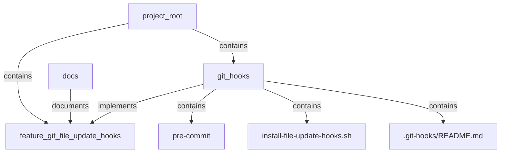

# MCP-BASE-STACK Knowledge Graph Guidelines

This document outlines the standards and best practices for working with the knowledge graph in the MCP-BASE-STACK project. The knowledge graph serves as the single source of truth for the project, representing components, features, files, and their relationships.

## Table of Contents

1. [Knowledge Graph Overview](#knowledge-graph-overview)
2. [Node Types](#node-types)
3. [Relationship Types](#relationship-types)
4. [Naming Conventions](#naming-conventions)
5. [Graph Operations](#graph-operations)
6. [Integration with Git Hooks](#integration-with-git-hooks)
7. [Validation and Verification](#validation-and-verification)
8. [Visualization](#visualization)
9. [Best Practices](#best-practices)

## Knowledge Graph Overview

The MCP-BASE-STACK knowledge graph is a directed graph that represents the structure and relationships of the project's components. It is implemented using both NetworkX (for in-memory operations) and RDF (for persistent storage).

### Purpose

The knowledge graph serves several purposes:

1. **Documentation**: It documents the project's structure, components, and their relationships.
2. **Dependency Management**: It tracks dependencies between components.
3. **Impact Analysis**: It helps analyze the impact of changes.
4. **Code Generation**: It can be used to generate code or configuration.
5. **Validation**: It validates the project's structure and relationships.

### Storage Formats

The knowledge graph is stored in two formats:

1. **GraphML**: Used for NetworkX operations (`core/kg/data/knowledge_graph.graphml`).
2. **Turtle (TTL)**: Used for RDF operations (`core/kg/data/knowledge_graph.ttl`).

## Node Types

The knowledge graph uses the following node types:

### Component

Represents a logical component of the system.

**Attributes**:
- `type`: "component"
- `name`: Human-readable name
- `status`: Current status (e.g., "planned", "implemented", "deprecated")
- `description`: Optional description

**Example**:
```python
kg.add_node(
    "git_hooks",
    type="component",
    name="Git Hooks",
    status="implemented"
)
```

### Feature

Represents a feature provided by the system.

**Attributes**:
- `type`: "feature"
- `name`: Human-readable name
- `description`: Description of the feature
- `owner`: Owner or responsible team
- `status`: Current status
- `created_at`: Creation timestamp

**Example**:
```python
kg.add_node(
    "feature_git_file_update_hooks",
    type="feature",
    name="Git File Update Hooks",
    description="Automatically updates README.md, .gitignore, LICENSE, and Knowledge Graph before every commit",
    owner="DevOps Team",
    status="implemented",
    created_at=datetime.now().isoformat()
)
```

### Directory

Represents a directory in the project.

**Attributes**:
- `type`: "directory"
- `path`: Path to the directory
- `last_modified`: Last modification timestamp
- `file_count`: Number of files in the directory

**Example**:
```python
kg.add_node(
    "docs_conventions",
    type="directory",
    path="docs/conventions",
    last_modified=os.path.getmtime("docs/conventions"),
    file_count=len(os.listdir("docs/conventions"))
)
```

### File

Represents a file in the project.

**Attributes**:
- `type`: "file"
- `path`: Path to the file
- `language`: Programming language or file type
- `last_modified`: Last modification timestamp

**Example**:
```python
kg.add_node(
    "style_guide_md",
    type="file",
    path="docs/conventions/style-guide.md",
    language="markdown",
    last_modified=os.path.getmtime("docs/conventions/style-guide.md")
)
```

### Hardware

Represents hardware components.

**Attributes**:
- `type`: "hardware"
- `name`: Human-readable name

**Example**:
```python
kg.add_node(
    "nvidia_gpu",
    type="hardware",
    name="NVIDIA RTX 4090 GPU"
)
```

### Software

Represents software components.

**Attributes**:
- `type`: "software"
- `name`: Human-readable name
- `status`: Current status

**Example**:
```python
kg.add_node(
    "librechat",
    type="software",
    name="LibreChat UI and API",
    status="configured"
)
```

### Platform

Represents platform components.

**Attributes**:
- `type`: "platform"
- `name`: Human-readable name

**Example**:
```python
kg.add_node(
    "wsl2",
    type="platform",
    name="Windows Subsystem for Linux 2"
)
```

### Model

Represents machine learning models.

**Attributes**:
- `type`: "model"
- `name`: Human-readable name

**Example**:
```python
kg.add_node(
    "mistral",
    type="model",
    name="Mistral 7B LLM"
)
```

## Relationship Types

The knowledge graph uses the following relationship types:

### contains

Indicates that one node contains another.

**Example**:
```python
kg.add_edge(
    "project_root",
    "git_hooks",
    relation="contains"
)
```

### implements

Indicates that a component implements a feature.

**Example**:
```python
kg.add_edge(
    "git_hooks",
    "feature_git_file_update_hooks",
    relation="implements"
)
```

### documents

Indicates that a file documents a feature or component.

**Example**:
```python
kg.add_edge(
    "git_hooks_kg_integration_plan",
    "feature_git_file_update_hooks",
    relation="documents"
)
```

### depends_on

Indicates that one component depends on another.

**Example**:
```python
kg.add_edge(
    "mcp_server",
    "knowledge_graph",
    relation="depends_on"
)
```

### connects_to

Indicates that one component connects to another.

**Example**:
```python
kg.add_edge(
    "librechat",
    "mcp_server",
    relation="connects_to"
)
```

### tests

Indicates that a file tests a component or feature.

**Example**:
```python
kg.add_edge(
    "test_knowledge_graph",
    "knowledge_graph",
    relation="tests"
)
```

### uses

Indicates that one component uses another.

**Example**:
```python
kg.add_edge(
    "librechat",
    "mongodb",
    relation="uses"
)
```

### containerized_in

Indicates that a component is containerized in another.

**Example**:
```python
kg.add_edge(
    "librechat",
    "docker",
    relation="containerized_in"
)
```

### served_by

Indicates that a model is served by a component.

**Example**:
```python
kg.add_edge(
    "mistral",
    "ollama",
    relation="served_by"
)
```

### accessible_from

Indicates that a component is accessible from another.

**Example**:
```python
kg.add_edge(
    "nvidia_gpu",
    "wsl2",
    relation="accessible_from"
)
```

### extends

Indicates that one component extends another.

**Example**:
```python
kg.add_edge(
    "nvidia_container",
    "docker",
    relation="extends"
)
```

### enables_access

Indicates that one component enables access to another.

**Example**:
```python
kg.add_edge(
    "nvidia_container",
    "nvidia_gpu",
    relation="enables_access"
)
```

### runs_on

Indicates that one component runs on another.

**Example**:
```python
kg.add_edge(
    "docker",
    "wsl2",
    relation="runs_on"
)
```

### integrates

Indicates that one component integrates with another.

**Example**:
```python
kg.add_edge(
    "librechat",
    "mistral",
    relation="integrates"
)
```

## Naming Conventions

### Node IDs

Node IDs should follow these conventions:

- **Component IDs**: Lowercase with underscores (snake_case)
  ```
  git_hooks
  knowledge_graph
  ```

- **Feature IDs**: Prefix with "feature_" followed by snake_case
  ```
  feature_git_file_update_hooks
  feature_knowledge_graph_integration
  ```

- **Directory IDs**: Path-based with underscores
  ```
  docs_conventions
  core_kg_scripts
  ```

- **File IDs**: Descriptive name based on file path, with underscores
  ```
  style_guide_md
  pre_commit_hook
  ```

### Relationship IDs

Relationship IDs should be lowercase with underscores (snake_case).

## Graph Operations

### Adding Nodes

When adding nodes to the knowledge graph, follow these guidelines:

1. **Check for Existing Nodes**: Always check if a node already exists before adding it.
2. **Provide All Required Attributes**: Ensure all required attributes are provided.
3. **Use Consistent Types**: Use the standard node types defined above.
4. **Update Both Graphs**: Update both the NetworkX and RDF graphs.

```python
def add_node(node_id, **attributes):
    """Add a node to the knowledge graph."""
    # Check if node already exists
    if node_id in nx_graph:
        # Update existing node
        for key, value in attributes.items():
            nx_graph.nodes[node_id][key] = value
    else:
        # Add new node
        nx_graph.add_node(node_id, **attributes)
    
    # Update RDF graph
    node_uri = ns[node_id]
    rdf_graph.add((node_uri, RDF.type, ns[attributes['type'].capitalize()]))
    for key, value in attributes.items():
        if key != 'type':
            rdf_graph.add((node_uri, ns[key], Literal(value)))
```

### Adding Relationships

When adding relationships to the knowledge graph, follow these guidelines:

1. **Check for Existing Nodes**: Ensure both source and target nodes exist.
2. **Check for Existing Relationships**: Avoid duplicate relationships.
3. **Use Standard Relationship Types**: Use the standard relationship types defined above.
4. **Update Both Graphs**: Update both the NetworkX and RDF graphs.

```python
def add_relationship(source_id, target_id, relation_type):
    """Add a relationship to the knowledge graph."""
    # Check if nodes exist
    if source_id not in nx_graph:
        raise ValueError(f"Source node {source_id} does not exist")
    if target_id not in nx_graph:
        raise ValueError(f"Target node {target_id} does not exist")
    
    # Check if relationship already exists
    if nx_graph.has_edge(source_id, target_id):
        # Update existing relationship
        nx_graph[source_id][target_id]['relation'] = relation_type
    else:
        # Add new relationship
        nx_graph.add_edge(source_id, target_id, relation=relation_type)
    
    # Update RDF graph
    source_uri = ns[source_id]
    target_uri = ns[target_id]
    relation_uri = ns[relation_type]
    rdf_graph.add((source_uri, relation_uri, target_uri))
```

### Querying the Graph

When querying the knowledge graph, follow these guidelines:

1. **Use the Appropriate Graph**: Use NetworkX for structural queries and RDF for semantic queries.
2. **Filter by Node Type**: Filter nodes by type for more specific queries.
3. **Use Standard Query Patterns**: Use standard query patterns for common operations.

```python
def get_components():
    """Get all components in the knowledge graph."""
    return [node for node, attrs in nx_graph.nodes(data=True) if attrs.get('type') == 'component']

def get_component_features(component_id):
    """Get all features implemented by a component."""
    return [target for source, target, attrs in nx_graph.out_edges(component_id, data=True) 
            if attrs.get('relation') == 'implements']

def get_feature_components(feature_id):
    """Get all components that implement a feature."""
    return [source for source, target, attrs in nx_graph.in_edges(feature_id, data=True) 
            if attrs.get('relation') == 'implements']
```

### Updating the Graph

When updating the knowledge graph, follow these guidelines:

1. **Atomic Updates**: Make updates atomic to maintain consistency.
2. **Validate Before Updating**: Validate changes before applying them.
3. **Update Both Graphs**: Update both the NetworkX and RDF graphs.
4. **Save After Updates**: Save the graph after making changes.

```python
def update_knowledge_graph():
    """Update the knowledge graph."""
    # Create a transaction or use a temporary graph
    temp_nx_graph = nx_graph.copy()
    temp_rdf_graph = Graph()
    temp_rdf_graph += rdf_graph
    
    try:
        # Make changes to temp graphs
        # ...
        
        # Validate changes
        if validate_graph(temp_nx_graph, temp_rdf_graph):
            # Apply changes
            nx_graph.clear()
            nx_graph.add_nodes_from(temp_nx_graph.nodes(data=True))
            nx_graph.add_edges_from(temp_nx_graph.edges(data=True))
            
            rdf_graph.remove((None, None, None))
            for s, p, o in temp_rdf_graph:
                rdf_graph.add((s, p, o))
            
            # Save graphs
            save_graphs()
        else:
            raise ValueError("Invalid graph state")
    except Exception as e:
        logging.error(f"Failed to update knowledge graph: {e}")
        # Rollback or handle error
```

## Integration with Git Hooks

The knowledge graph is integrated with Git hooks to ensure it is updated automatically before every commit.

### Pre-commit Hook

The pre-commit hook updates the knowledge graph before every commit:

```bash
# Update Knowledge Graph
if [ -f "core/kg/scripts/update_knowledge_graph.py" ]; then
    echo "Updating Knowledge Graph..."
    
    # Run the update script
    if python3 core/kg/scripts/update_knowledge_graph.py; then
        echo "Knowledge Graph updated successfully"
    else
        echo "Warning: Knowledge Graph update failed"
    fi
else
    echo "Knowledge Graph update script not found, skipping"
fi
```

### Update Script

The update script (`core/kg/scripts/update_knowledge_graph.py`) performs the following operations:

1. Scan the project directory for changes
2. Update the knowledge graph based on changes
3. Validate the knowledge graph
4. Save the knowledge graph

## Validation and Verification

### Graph Validation

The knowledge graph should be validated to ensure it is consistent and accurate:

1. **Node Validation**: Ensure all nodes have the required attributes.
2. **Relationship Validation**: Ensure all relationships connect valid nodes.
3. **Consistency Validation**: Ensure the NetworkX and RDF graphs are consistent.
4. **Semantic Validation**: Ensure the graph follows the semantic rules.

```python
def validate_graph(nx_graph, rdf_graph):
    """Validate the knowledge graph."""
    # Validate nodes
    for node, attrs in nx_graph.nodes(data=True):
        if 'type' not in attrs:
            return False
    
    # Validate relationships
    for source, target, attrs in nx_graph.edges(data=True):
        if 'relation' not in attrs:
            return False
    
    # Validate consistency
    # ...
    
    # Validate semantics
    # ...
    
    return True
```

### Graph Verification

The knowledge graph should be verified to ensure it accurately represents the project:

1. **File Existence**: Verify that files in the graph exist in the project.
2. **Directory Structure**: Verify that the directory structure in the graph matches the project.
3. **Component Relationships**: Verify that component relationships are accurate.
4. **Feature Implementation**: Verify that features are implemented by the correct components.

```python
def verify_graph():
    """Verify the knowledge graph against the project."""
    # Verify files
    for node, attrs in nx_graph.nodes(data=True):
        if attrs.get('type') == 'file':
            file_path = attrs.get('path')
            if file_path and not os.path.isfile(file_path):
                logging.warning(f"File {file_path} does not exist")
    
    # Verify directories
    # ...
    
    # Verify components
    # ...
    
    # Verify features
    # ...
```

## Visualization

The knowledge graph can be visualized to provide insights into the project structure:

### Graph Visualization

Use tools like Graphviz or D3.js to visualize the graph:

```python
def visualize_graph(output_file="graph.png"):
    """Visualize the knowledge graph."""
    import matplotlib.pyplot as plt
    import networkx as nx
    
    plt.figure(figsize=(12, 8))
    pos = nx.spring_layout(nx_graph)
    
    # Draw nodes
    node_colors = {
        'component': 'lightblue',
        'feature': 'lightgreen',
        'directory': 'lightgray',
        'file': 'white'
    }
    
    for node_type, color in node_colors.items():
        nodes = [node for node, attrs in nx_graph.nodes(data=True) if attrs.get('type') == node_type]
        nx.draw_networkx_nodes(nx_graph, pos, nodelist=nodes, node_color=color, node_size=500)
    
    # Draw edges
    edge_colors = {
        'contains': 'gray',
        'implements': 'green',
        'documents': 'blue',
        'depends_on': 'red'
    }
    
    for relation, color in edge_colors.items():
        edges = [(source, target) for source, target, attrs in nx_graph.edges(data=True) if attrs.get('relation') == relation]
        nx.draw_networkx_edges(nx_graph, pos, edgelist=edges, edge_color=color, width=1.5)
    
    # Draw labels
    nx.draw_networkx_labels(nx_graph, pos, font_size=10)
    
    plt.axis('off')
    plt.tight_layout()
    plt.savefig(output_file, dpi=300)
    plt.close()
```

### Mermaid Diagrams

Use Mermaid diagrams for documentation:

```markdown

```

## Best Practices

### General Best Practices

1. **Keep the Graph Updated**: Update the knowledge graph whenever the project changes.
2. **Use Standard Node Types**: Use the standard node types defined above.
3. **Use Standard Relationship Types**: Use the standard relationship types defined above.
4. **Follow Naming Conventions**: Follow the naming conventions for node and relationship IDs.
5. **Validate and Verify**: Validate and verify the graph regularly.

### Node Best Practices

1. **Unique IDs**: Ensure node IDs are unique and descriptive.
2. **Complete Attributes**: Provide all required attributes for each node.
3. **Accurate Types**: Use the correct node type for each node.
4. **Up-to-date Information**: Keep node attributes up-to-date.

### Relationship Best Practices

1. **Accurate Relationships**: Ensure relationships accurately represent the project structure.
2. **Appropriate Types**: Use the appropriate relationship type for each relationship.
3. **Avoid Cycles**: Avoid creating cycles in the graph unless necessary.
4. **Maintain Consistency**: Ensure relationships are consistent with the project structure.

### Integration Best Practices

1. **Automate Updates**: Automate knowledge graph updates using Git hooks.
2. **Validate Changes**: Validate changes before applying them.
3. **Handle Errors**: Handle errors gracefully during updates.
4. **Log Changes**: Log changes to the knowledge graph for auditing.

## Conclusion

Following these guidelines ensures that the knowledge graph remains an accurate and useful representation of the MCP-BASE-STACK project. The knowledge graph serves as the single source of truth for the project, providing insights into its structure, components, and relationships.

If you have any questions or suggestions for improving these guidelines, please open an issue or pull request.